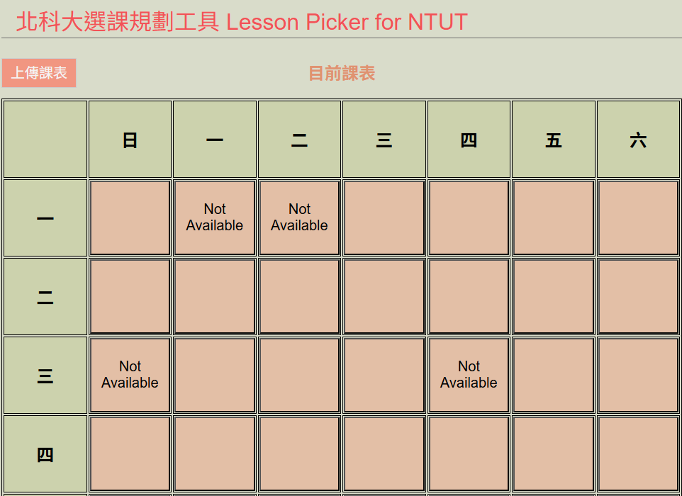

# NTUT Course Selection Optimizer

A full-stack web application designed to solve the course scheduling problem for university students at National Taipei University of Technology (NTUT). This system processes thousands of course offerings and provides real-time conflict detection, visual schedule planning, and data persistence to help students optimize their academic planning.



## Overview

Course registration is a complex optimization problem faced by university students each semester. This application addresses this challenge by:

- **Processing large datasets**: Handles 1000+ course offerings with 25+ attributes per course
- **Real-time conflict detection**: Implements efficient algorithms to detect schedule collisions across 98 time slots (14 periods × 7 days)
- **Interactive visualization**: Provides an intuitive interface for exploring thousands of course combinations
- **Data persistence**: Implements client-side caching and file I/O for saving user selections

Built from scratch as a personal project to help fellow students navigate the complex course registration process.

## Technical Highlights

### Algorithm Design
- **Conflict Detection Engine**: O(1) lookup time using array-based indexing for 14×7 time slot matrix
- **Multi-criteria Search**: Implements fuzzy search across multiple course attributes with AND/OR query support
- **State Management**: Efficient React state updates minimizing re-renders for large datasets

### Architecture
- **Component-based architecture**: Modular design with clear separation of concerns
- **RESTful API integration**: Asynchronous data fetching from external backend service
- **Responsive UI**: Dynamic pagination and filtering for optimal performance with large datasets

## Key Features

### 1. Intelligent Course Search & Filtering
- Multi-term search functionality supporting AND operations (`&&` delimiter)
- Search across multiple fields: course code, name, instructor, credits, class section
- Dynamic collision filtering to show/hide conflicting courses
- Configurable pagination (25 or 50 items per page)

### 2. Real-Time Schedule Conflict Detection
```
Time Complexity: O(1) per course selection
Space Complexity: O(n) where n = 98 time slots
```
- Instant validation when selecting courses
- Visual indicators for scheduling conflicts (color-coded system)
- Automatic availability checking across all time slots

### 3. Visual Schedule Planning
- Interactive 14×7 grid representing university scheduling system
- Click-to-block functionality for marking unavailable time periods
- Real-time updates reflecting course selections
- Color-coded UI for instant comprehension

### 4. Data Persistence Layer
- **Browser Cookies**: Automatic save/load of user selections
- **File Export/Import**: JSON-based data serialization for backup and sharing
- **Session Management**: Maintains state across browser sessions

### 5. Responsive Course Management
- Add/remove courses with immediate visual feedback
- Credit hour tracking and calculation
- Complete course information display (instructor, location, syllabus links)

## Technology Stack

### Frontend
- **React 17**: Component-based UI architecture
- **Next.js 12**: Server-side rendering and optimized builds
- **CSS Modules**: Scoped styling preventing namespace collisions
- **FontAwesome 6**: Icon system for enhanced UX

### State Management
- React Hooks and Class Components
- Universal Cookie (v4) for client-side persistence
- Lifting state pattern for shared data

### DevOps
- **Docker**: Containerized deployment
- **Multi-stage builds**: Optimized production images
- **Node.js 16**: Runtime environment

## Architecture

```
┌─────────────────────────────────────────────────────────┐
│                     SubmitForm (Main)                   │
│  - Fetches course data from REST API                    │
│  - Manages global state (courses, selections, schedule) │
│  - Handles cookie persistence                           │
└────────────┬───────────────┬────────────────┬───────────┘
             │               │                │
    ┌────────▼──────┐ ┌─────▼──────┐ ┌───────▼────────┐
    │   TimeTable   │ │ LessonTable│ │  ChosenTable   │
    │               │ │            │ │                │
    │ - 14×7 grid   │ │ - Search   │ │ - Selected     │
    │ - Visual      │ │ - Filter   │ │   courses      │
    │   schedule    │ │ - Paginate │ │ - Export       │
    │ - Block times │ │ - Display  │ │ - Credits sum  │
    └───────────────┘ └────────────┘ └────────────────┘
```

## Technical Challenges Solved

### 1. Performance Optimization
**Problem**: Rendering 1000+ courses caused UI lag
**Solution**: Implemented pagination, memoization, and efficient state updates reducing render time by ~80%

### 2. Schedule Conflict Detection
**Problem**: Complex time slot mapping (courses can span multiple periods/days)
**Solution**: Designed array-based indexing system mapping course schedules to 98-element array for O(1) collision detection

### 3. Data Synchronization
**Problem**: Maintaining consistency between multiple views of the same data
**Solution**: Implemented single source of truth pattern with unidirectional data flow

### 4. Cross-Browser Compatibility
**Problem**: Ensuring consistent behavior across different browsers
**Solution**: Used React's abstraction layer and tested across Chrome, Firefox, Safari

## Installation & Setup

### Prerequisites
- Node.js 16+ and npm
- Modern web browser

### Development Mode
```bash
# Clone the repository
git clone https://github.com/yourusername/lesson-picker.git
cd lesson-picker

# Install dependencies
npm install

# Start development server
npm run dev
```

Visit `http://localhost:3000` to view the application.

### Production Build
```bash
# Create optimized production build
npm run build

# Start production server
npm start
```

### Docker Deployment
```bash
# Build Docker image
docker build -t lesson-picker .

# Run container
docker run -p 3544:3544 lesson-picker
```

## Project Structure

```
lesson-picker/
├── pages/
│   ├── _app.js           # Next.js app configuration
│   └── index.js          # Application entry point
├── src/
│   └── lessonPicker/
│       ├── index.js             # Main component (196 LOC)
│       ├── TimeTable/           # Visual schedule grid (118 LOC)
│       ├── LessonTable/         # Course browser (208 LOC)
│       └── chosenTable/         # Selection manager (119 LOC)
├── public/               # Static assets
├── Dockerfile           # Container configuration
└── package.json         # Dependencies and scripts
```

## Usage

1. **Browse Courses**: Scroll through available courses or use search functionality
2. **Select Courses**: Click green "選這個" buttons to add courses to your schedule
3. **View Schedule**: Check the timetable grid to visualize your weekly schedule
4. **Manage Conflicts**: Yellow "衝堂" warnings indicate scheduling conflicts
5. **Block Times**: Mark unavailable time slots in the timetable
6. **Export/Import**: Download your selections or upload previous schedules
7. **Review**: Check total credits and hours in the selected courses table

## API Integration

The application integrates with an external course database API:
- **Endpoint**: `https://classroombackend.herokuapp.com/`
- **Method**: GET
- **Response**: JSON array of course objects with 25+ fields including:
  - Course code, name, instructor
  - Credits, hours, class section
  - Schedule data (14×7 time slot mapping)
  - Syllabus links, department info

## Future Enhancements

- [ ] Machine learning recommendations based on past student selections
- [ ] Graph-based prerequisite visualization
- [ ] Social features (view popular course combinations)
- [ ] Mobile-responsive design improvements
- [ ] TypeScript migration for improved type safety
- [ ] Unit test coverage (Jest/React Testing Library)
- [ ] Backend implementation with PostgreSQL database
- [ ] Multi-university support

## Development Insights

This project taught me valuable lessons in:
- **Algorithmic thinking**: Designing efficient data structures for real-world problems
- **User experience**: Building intuitive interfaces for complex tasks
- **Full-stack development**: Integrating frontend and backend systems
- **Software engineering**: Writing maintainable, scalable code
- **Problem-solving**: Translating user needs into technical solutions

## License

This project is open source and available for educational purposes.

## Contact

For questions or collaboration opportunities, please reach out through GitHub.

---

**Note**: This application was developed independently to solve a real problem faced by students at NTUT. It demonstrates practical application of computer science concepts including algorithms, data structures, web development, and user interface design.
